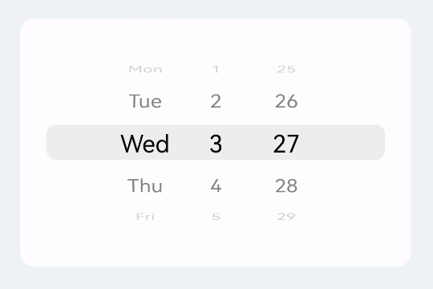
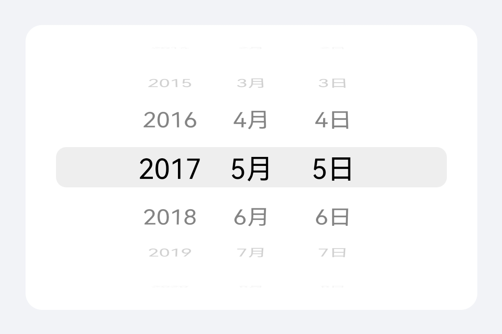
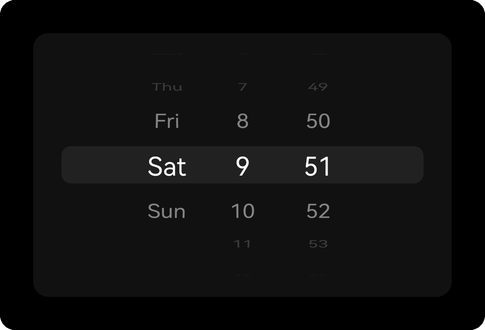

WheelPicker
===
iOS风格的滚轮选择器


[](https://codebeat.co/projects/github-com-ty0x2333-wheelpicker-master)

其他语言版本: [*English*](README.md)

特性
---
1. 支持 `Day` / `Night` 模式
2. 自定义样式
3. 支持循环滚动
4. 支持震动反馈

预览
---


组件
---
1. DatePicker

    [DatePicker 使用方法](example/src/main/java/sh/tyy/wheelpicker/example/DatePickerExampleActivity.kt)

    `年-月-日` 或 `年-月` 选择器

    支持 `最大` 和 `最小` 时间限制

    |亮色模式|暗色模式|
    |---|---|
    |||

2. WeekdayTimePicker

    [WeekdayTimePicker 使用方法](example/src/main/java/sh/tyy/wheelpicker/example/WeekdayTimePickerExampleActivity.kt)

    `周几-小时-分钟` 选择器

    |亮色模式|暗色模式|
    |---|---|
    |||

3. DayTimePicker

    [DayTimePicker 使用方法](example/src/main/java/sh/tyy/wheelpicker/example/DayTimePickerExampleActivity.kt)

    `日-小时-分钟` 选择器

下载及安装
---

通过 Gradle 从 [Maven Central](https://search.maven.org/search?q=g:%20sh.tyy%20a:%20wheelpicker) 下载最新的 AAR :

```gradle
implementation 'sh.tyy:wheelpicker:0.3.1'
```

自定义
---
自定义item的样式的方式如同 `RecyclerView` 一样.
你需要提供一个 `BaseWheelPickerView.Adapter` 和 `BaseWheelPickerView.ViewHolder`.

需要特别注意的是: ViewHolder 的 itemView 需要是一个固定高度的视图.

> 毕竟 `WheelPicker` 是基于 `RecyclerView` 的. 这样做可以尽可能保证其性能和可靠性.

自定义 WheelPicker 请参考 [CustomWheelPickerView.kt](app/src/main/java/sh/tyy/wheelpicker/example/custom/CustomWheelPickerView.kt)

这是自定义示例的样子:


**更复杂的自定义 (例如 多列), 请参考 [WeekdayTimePickerView](WheelPicker/src/main/java/sh/tyy/wheelpicker/WeekdayTimePickerView.kt)**

灵感及参考
---
WheelPicker 灵感来自于 [devilist/RecyclerWheelPicker](https://github.com/devilist/RecyclerWheelPicker).

License
---
WheelPicker is available under the Apache 2.0 license. See the LICENSE file for more info.